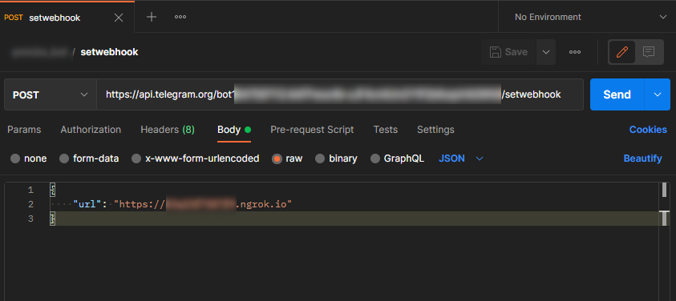

# Percobaan Telegram Bot menggunakan NodeJS

## Langkah

- kirim pesan ke Telegram @BotFather
- /newbot
- pilih nama bot
- simpan token yang diberikan untuk akses HTTP API
- npm init;
- npm i express axios body-parser --save;
- sesuaikan index.js dengan token bot yang kamu terima

## Tips

- gunakan https://ngrok.com untuk webook Telegram ke localhost nodejs
- set webhook: https://core.telegram.org/bots/api#setwebhook
  
- mangfaatkan fitur ngrok.com untuk inspeksi request http di http://127.0.0.1:4040/inspect/http
